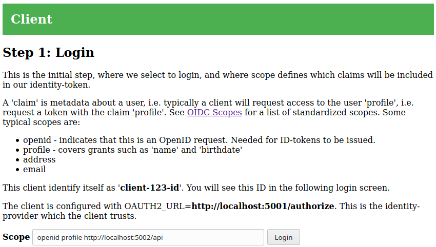
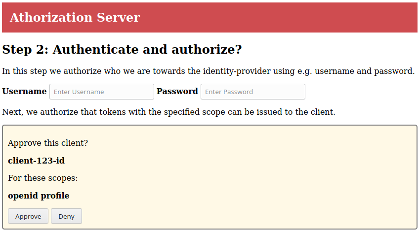
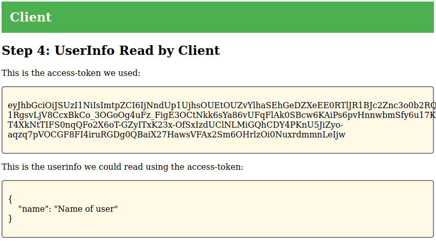
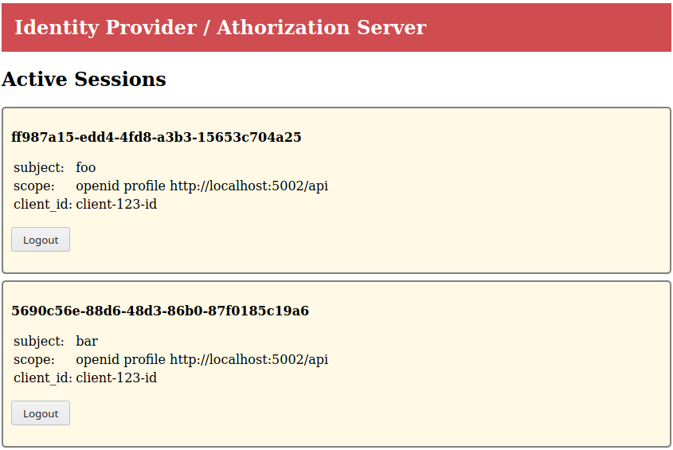

# OIDC/OAuth2 Workshop

This repository contain an example implementation of an OIDC/OAuth2 client
(confidential client), identity provider and protected resource.

The implementation is for educational purposes only and NOT suited for anything
that require real security.

## Usage

See below for how to start the client, identity provider and protected
resource. This section presents an usage example.

The client is available at `http://localhost:5000`. Point your browser at this
endpoint and you should see the following:

> 

This is the initial login step. The `scope` input defines our desired scope of
the OIDC/OAuth2 tokens we will obtain through the identity provider. Scopes are
space separated strings and the client defaults to `openid profile`, which is
the standard for OIDC. The protected resource in this workshop only allows
access if the scope `http://localhost:5002/api` is included.

When you select `Login`, you are redirected to the Identity
provider/Authorization server (IdP):

> 

The IdP combines authentication and authorization and does not implement real
users. Thus you can enter any username and use the password `valid`.

When you select `Approve`, the IdP redirects your browser back to the client
which completes the OIDC/OAuth2 negotiation. The client will show information
about the tokens it received:

> 

The client supports reading the OIDC `userinfo` data from the IdP. The IdP will
return additional information about the user if the access token includes the
`profile` scope:

> 

The client also supports reading information from the protected resource
(OAuth2). The protected resource will respond differently depending on whether
the token contains the scope `http://localhost:5002/api` or not. The following
example show usage without the `api` scope:

> 

The IdP also provides an overview of active sessions at `http://localhost:5001/`

> 

## Running the Components

The following commands will run the three components, client,
identity-provider/auth server and protected API as separate containers.

Use the following command to run the client:

```console
(cd client/ && make build dev)
```

Use the following command to run the identity provider/auth-server:

```console
(cd idp-auth-server/ && make build dev)
```

Use the following command to run the protected API:

```console
(cd protected-api/ && make build dev)
```

## Using Alternative Identity Providers

Running the components with the local identity provider/authorization server is
enabled with the following environment variables for the client. These can be
changed to refer to an external identity provider.

```
export OAUTH2_URL=http://localhost:5001/authorize
export OAUTH2_TOKEN_URL=http://localhost:5001/token
export OAUTH2_USERINFO_URL=http://localhost:5001/userinfo
export OIDC_JWKS_URL=http://localhost:5001/.well-known/jwks.json
export CLIENT_ID=client-123-id
export CLIENT_SECRET=client-123-password
```
